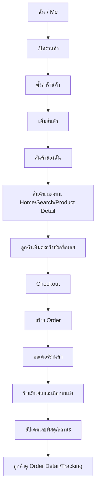

# NP Market Supabase Seller Flow

เอกสารนี้คือแผนเชื่อม flow ร้านค้าในแอปเดียวกับ Supabase โดยอิงโครงสร้าง Shopee แต่ตัด ShopeePay, Coins และ Live ออกตามขอบเขตของ NP Market

## เส้นทางหลัก



## 1. เปิดร้านค้า

หน้าที่อยู่ในเมนู `ฉัน > เริ่มขายบน NP Market > เปิดร้าน`

ข้อมูลที่ต้องกรอก:

- ชื่อร้าน
- หมวดหมู่ร้าน
- ชื่อเจ้าของร้าน
- เบอร์โทรร้าน
- ที่อยู่รับสินค้า/ที่อยู่ร้าน
- จังหวัดต้นทางจัดส่ง
- รายละเอียดร้าน
- ขนส่งที่ร้านรองรับ: Flash Express, KEX, Express, ไปรษณีย์ไทย, J&T Express

ตาราง Supabase:

- `profiles`: ข้อมูลผู้ใช้
- `shops`: ข้อมูลร้าน
- `shop_carriers`: ขนส่งที่ร้านเปิดใช้
- `carriers`: รายชื่อขนส่งกลาง

ผลลัพธ์:

- สร้างร้านสถานะ `active`
- ผู้ใช้กลายเป็น seller ได้ในแอปเดียว ไม่ต้องแยกแอป

## 2. ตั้งค่าร้านค้า

หน้าที่อยู่ใน `ฉัน > ร้านของฉัน > ตั้งค่าร้านค้า`

ข้อมูลที่แก้ได้:

- ชื่อร้าน
- ประเภทร้าน
- คำอธิบายร้าน
- เบอร์โทร
- ที่อยู่ร้าน
- จังหวัดต้นทาง
- ขนส่งที่รองรับ
- สถานะเปิด/พักร้าน

ตาราง Supabase:

- `shops`
- `shop_carriers`

## 3. เพิ่มสินค้า

หน้าที่อยู่ใน `ฉัน > ร้านของฉัน > เพิ่มสินค้า`

ข้อมูลที่ต้องมี:

- ชื่อสินค้า
- หมวดหมู่สินค้า
- รายละเอียดสินค้า
- ราคา
- ราคาเต็มก่อนลด
- สต๊อก
- SKU
- น้ำหนัก
- ขนาดพัสดุ
- จังหวัดต้นทาง
- รูปสินค้า
- วิดีโอสินค้า ถ้ามี
- สี/ตัวเลือกสินค้า ถ้ามี
- ไซส์ ถ้ามี
- ตารางขนาดสินค้า ถ้าร้านอัปโหลดเอง
- สถานะสินค้า: draft, active, hidden, sold_out

ตาราง Supabase:

- `products`: ข้อมูลหลักสินค้า
- `product_media`: รูป/วิดีโอสินค้า
- `product_variants`: สี ไซส์ ราคา สต๊อกย่อย
- `product_size_charts`: ตารางขนาดแบบรูปหรือข้อมูล
- `categories`: หมวดหมู่

หลัก UX:

- ไม่บังคับให้ทุกสินค้ามีไซส์
- ไม่บังคับให้ทุกสินค้ามีตารางขนาด
- ถ้ามี variation ต้องเลือกก่อนซื้อ
- ถ้า stock เป็น 0 ให้แสดง sold out และซื้อไม่ได้

## 4. สินค้าของฉัน

หน้าที่อยู่ใน `ฉัน > ร้านของฉัน > สินค้าของฉัน`

ต้องแสดง:

- แท็บ: ทั้งหมด, กำลังขาย, หมดสต๊อก, ซ่อน, แบบร่าง
- รูปสินค้า
- ชื่อสินค้า
- ราคา
- สต๊อก
- ยอดขาย
- สถานะสินค้า
- ปุ่มแก้ไข
- ปุ่มเปิด/ปิดสินค้า
- ปุ่มเพิ่มสินค้า

ตาราง Supabase:

- `products`
- `product_media`
- `product_variants`

## 5. ออเดอร์ร้านค้า

หน้าที่อยู่ใน `ฉัน > ร้านของฉัน > ออเดอร์ร้านค้า`

สถานะหลัก:

- `seller_confirming`: รอร้านยืนยัน
- `awaiting_shipment`: รอจัดส่ง
- `packed`: เตรียมพัสดุแล้ว
- `shipped`: ส่งแล้ว
- `in_transit`: ขนส่งกำลังนำส่ง
- `delivered`: ลูกค้าได้รับแล้ว
- `completed`: สำเร็จ
- `cancelled`: ยกเลิก
- `return_refund`: คืนสินค้า/คืนเงิน

ต้องแสดง:

- แท็บตามสถานะ
- รายการสินค้าในออเดอร์
- ชื่อลูกค้า/จังหวัดปลายทางแบบย่อ
- ยอดรวม
- วิธีชำระเงิน
- ขนส่งที่ลูกค้าเลือก
- ปุ่มยืนยันออเดอร์
- ปุ่มเลือกขนส่ง
- ช่องเลขพัสดุ
- ปุ่มอัปเดตสถานะ

ตาราง Supabase:

- `orders`
- `order_items`
- `order_shipments`
- `order_tracking_events`
- `shops`
- `products`
- `product_variants`

## 6. Tracking ฝั่งลูกค้า

หน้าที่อยู่ใน `ฉัน > การซื้อของฉัน > รายละเอียดคำสั่งซื้อ`

ต้องแสดง:

- สถานะคำสั่งซื้อ
- ขนส่ง
- เลขพัสดุ
- timeline การเดินทางของสินค้า
- สินค้าในออเดอร์
- ที่อยู่จัดส่ง
- ยอดชำระเงิน
- ปุ่มติดต่อร้าน
- ปุ่มให้คะแนนเมื่อสำเร็จ

ตาราง Supabase:

- `orders`
- `order_items`
- `order_shipments`
- `order_tracking_events`
- `reviews`
- `chat_threads`
- `chat_messages`

## Flow ที่ต้องเชื่อมในโค้ดรอบต่อไป

1. เชื่อม `supabase_flutter` และอ่านค่าด้วย `--dart-define`
2. ทำ `SupabaseMarketRepository`
3. แทน mock data ด้วย query จาก Supabase ทีละจุด
4. เริ่มจาก seller flow ก่อน: shops -> products -> orders -> tracking
5. ต่อ buyer flow: home/search/detail/cart/checkout/orders
6. เพิ่ม Auth จริงหลัง route หลักนิ่ง

## Environment ที่ต้องใช้

```text
SUPABASE_URL=https://zptyyrunbshsxdhiuuhq.supabase.co
SUPABASE_ANON_KEY=<คัดลอกจาก Supabase Dashboard>
```

ห้ามใส่ anon key ตรง ๆ ในโค้ด ให้ส่งผ่าน `--dart-define` ตอนรันหรือ build

## หมายเหตุเรื่อง RLS

Migration หลักสร้างตารางครบแล้ว แต่ Supabase เตือนว่า `carriers` และ `categories` ยังไม่ได้เปิด RLS เพราะเป็นข้อมูล lookup กลาง ถ้าจะเปิดให้ปลอดภัยขึ้น ให้ใช้ policy แบบอ่านได้ทุกคน แต่ห้าม client แก้ไขเอง:

```sql
alter table public.carriers enable row level security;
alter table public.categories enable row level security;

create policy "carriers are readable"
on public.carriers for select
using (true);

create policy "categories are readable"
on public.categories for select
using (true);
```

ส่วนการเพิ่ม/แก้ carrier และ category ควรทำจาก admin/service role เท่านั้น
